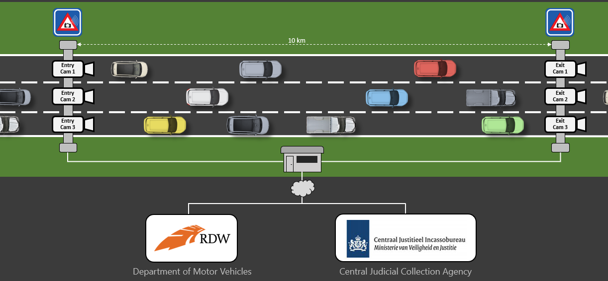
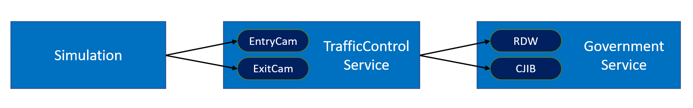
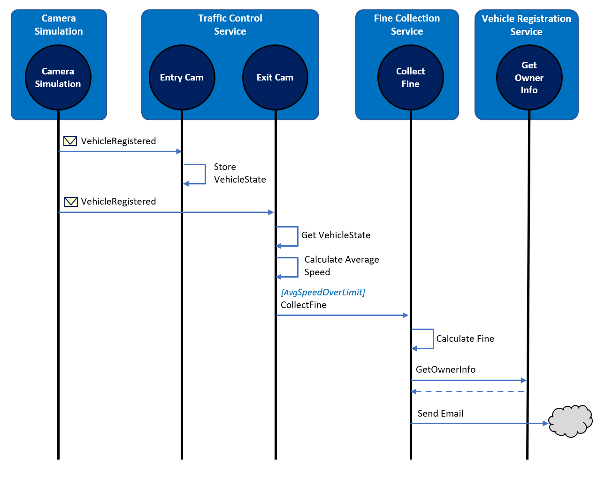
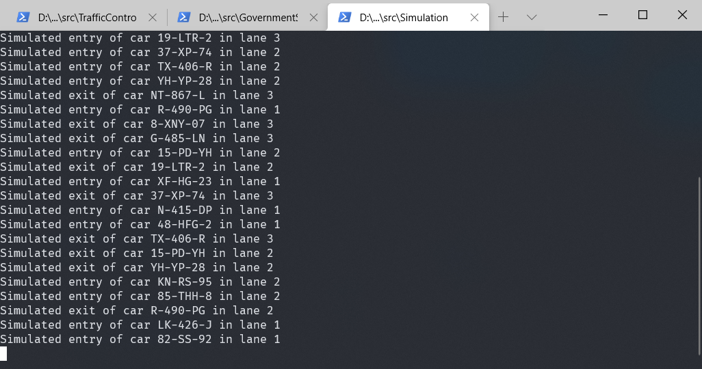
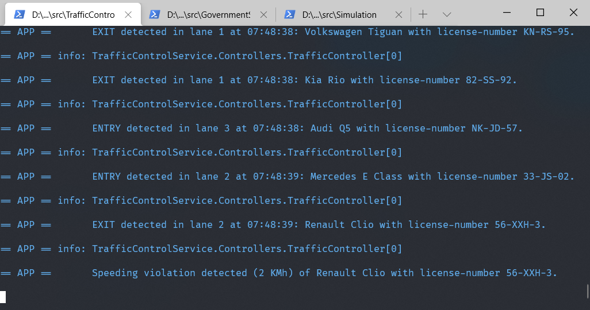
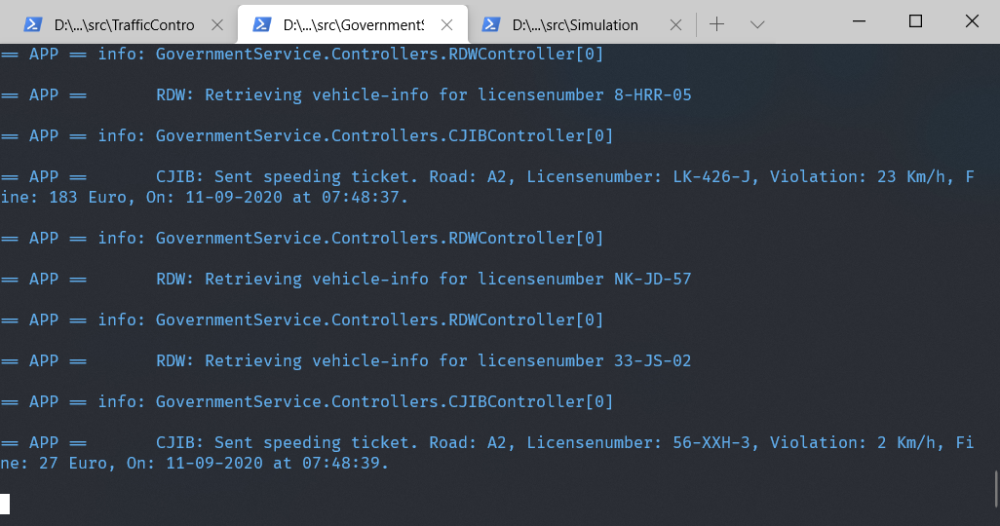
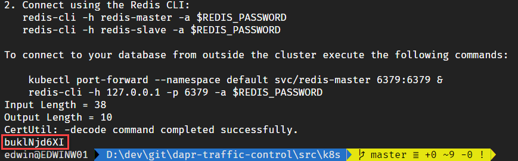

# Dapr Traffic Control Sample

| Attribute            | Details             |
| -------------------- | ------------------- |
| Dapr runtime version | v1.0.0-rc.2         |
| .NET SDK version     | v1.0.0-rc02         |
| Dapr CLI version     | v1.0.0-rc.2         |
| Language             | C# (.NET Core)      |
| Environment          | Local or Kubernetes |

This repository contains a sample application that simulates a traffic-control system using Dapr. For this sample I've used a speeding-camera setup as can be found on several Dutch highways. Over the entire stretch the average speed of a vehicle is measured and if it is above the speeding limit on this highway, the driver of the vehicle receives a speeding ticket.

## Overview
This is an overview of the fictitious setup I'm simulating in this sample:



There's 1 entry-camera and 1 exit-camera per lane. When a car passes an entry-camera, the license-number of the car is registered.

In the background, information about the vehicle  is retrieved from the Department Of Motor-vehicles - DMV (or RDW in Dutch) by calling their web-service.

When the car passes an exit-camera, this is registered by the system. The system then calculates the average speed of the car based on the entry- and exit-timestamp. If a speeding violation is detected, a message is sent to the Central Judicial Collection Agency - CJCA (or CJIB in Dutch) will send a speeding-ticket to the driver of the vehicle.

## Simulation
In order to simulate this in code, I created several services as shown below:



- The **Simulation** is a .NET Core console application that will simulate passing cars.
- The **TrafficControlService** is an ASP.NET Core WebAPI application that offers 2 endpoints: *Entrycam* and *ExitCam*.
- The **Government** service is an ASP.NET Core WebAPI application that offers 2 endpoints: *RDW* (for retrieving vehicle information) and *CJIB* (for sending speeding tickets).

The way the simulation works is depicted in the sequence diagram below:



1. The **Simulation** generates a random license-number and sends a *VehicleRegistered* message (containing this license-number, a random entry-lane (1-3) and the timestamp) to the *EntryCam* endpoint of the **TrafficControlService**.
2. The **TrafficControlService** calls the *RDW* endpoint of the **GovernmentService** to retrieve the brand and model of the vehicle corresponding to the license-number.
3. The **TrafficControlService** stores the VehicleState (vehicle information and entry-timestamp) in the state-store.
4. After some random interval, the **Simulation** sends a *VehicleRegistered* message to the *ExitCam* endpoint of the **TrafficControlService** (containing the license-number generated in step 1, a random exit-lane (1-3) and the exit timestamp).
5. The **TrafficControlService** retrieves the VehicleState from the state-store.
6. The **TrafficControlService** calculates the average speed of the vehicle using the entry- and exit-timestamp.
7. If the average speed is above the speed-limit, the **TrafficControlService** will sent a *SpeedingViolationDetected* message (containing the license-number of the vehicle, the identifier of the road, the speeding-violation in KMh and the timestamp of the violation) to the *CJIB* endpoint of the **GovernmentService**.
8. The **GovernmentService** calculates the fine for the speeding-violation and simulates sending a speeding-ticket to the owner of the vehicle.

All actions described in this sequence are logged to the console during execution so you can follow the flow.

## Dapr
This sample uses Dapr for implementing several aspects of the application. In the diagram below you see a schematic overview of the setup:


1. For communicating messages, the **publish and subscribe** building-block is used. 
1. For doing request/response type communication with a service, the  **service-to-service invocation** building-block is used. 
1. For storing the state of a vehicle, the **state management** building-block is used. 
1. The RDW controller in the GovernmentService has an operation `GetVehicleInfo` that uses a `VehicleInfoRepository` to retrieve vehicle data. The constructor of this repository expects a connection-string as argument. This connection-string is stored in a secrets file. The GovernmentService uses the **secrets management** building block with the local file component to get the connection-string.

In this sample, the Reddis component is used for both state management as well as for pub/sub.

## Running the sample in Dapr self-hosted mode
Execute the following steps to run the sample application in self hosted mode:

1. Make sure you have installed Dapr on your machine in self-hosted mode as described in the [Dapr documentation](https://docs.dapr.io/getting-started/install-dapr/).

2. Open three separate command-shells.

3. In the first shell, change the current folder to the *src/GovernmentService* folder of this repo and execute the following command (using the Dapr cli) to run the **GovernmentService**:

    ```
    dapr run --app-id governmentservice --app-port 6000 --dapr-grpc-port 50002 --config ../dapr/config/config.yaml --components-path ../dapr/components dotnet run
    ```

4. In the second shell, change the current folder to the *src/TrafficControlService* folder of this repo and execute the following command (using the Dapr cli) to run the **TrafficControlService**:

    ```
    dapr run --app-id trafficcontrolservice --app-port 5000 --dapr-grpc-port 50001 --config ../dapr/config/config.yaml --components-path ../dapr/components dotnet run
    ```

5. In the third shell, change the current folder to the *src/Simulation* folder of this repo and execute the following command to run the **Simulation**:

    ```
    dapr run --app-id simulation --dapr-grpc-port 50003 --config ../dapr/config/config.yaml --components-path ../dapr/components dotnet run
    ```

You should now see logging in each of the shells, similar to the logging shown below:

**Simulation:**  



**TrafficControlService:**  



**GovernmentService:**  



## Running the sample on Kubernetes
Execute the following steps to run the sample application on Kubernetes:

First you need to build the Docker images for the three services:

1. Open a command-shell.

2. Change the current folder to the *src/GovernmentService* folder of this repo.

3. Build the Docker image:

    ```
    docker build -t dapr-trafficcontrol/governmentservice .
    ```

4. Change the current folder to the *src/TrafficControlService* folder of this repo.

5. Build the Docker image:

    ```
    docker build -t dapr-trafficcontrol/trafficcontrolservice .
    ```

6. Change the current folder to the *src/Simulation* folder of this repo.

7. Build the Docker image:

    ```
    docker build -t dapr-trafficcontrol/simulation .
    ```

Now you're ready to run the application on Kubernetes:

1. Make sure you have installed Dapr on your machine on a Kubernetes cluster as described in the [Dapr documentation](https://docs.dapr.io/getting-started/install-dapr/).

2. Make sure you have built the Docker images for the 3 separate services so they are available on your machine.

3. Open a command-shell.

4. Change the current folder to the *src/k8s* folder of this repo.

5. Install Redis in your Kubernetes cluster by executing the `install-redis.ps1` script.

6. After the script has executed, a password is shown. Copy this password to your clipboard:

    

7. Open the files `state-redis.yaml` and `pubsub-redis.yaml` and paste the password as the value for the `redisPassword` metadata setting. Save the files.

8.  Execute the `start.ps1` script.

You can examine the logging for the 3 individual services in several different ways. Let's do it using the Docker CLI:

1. Find out the container Id of the services:

    ```
    docker ps
    ```

  > Make sure you pick the Id of a container running the .NET service and not the Dapr sidecar (the command will start with `/daprd`). If you do pick the Id of a dapr sidecar container, you can check out the Dapr logging emitted by the sidecar.

2. View the log for each of the services (replace the Id with the Id of one of your services):

    ```
    docker logs e2ed262f836e
    ```

To stop the application and remove everything from the Kubernetes cluster, execute the `stop.ps1` script.

## Disclaimer
The code in this repo is NOT production grade and lacks any automated testing. It is intentionally kept as simple as possible (KISS). Its primary purpose is demonstrating several Dapr concepts and not being a full fledged application that can be put into production as is.

The author can in no way be held liable for damage caused directly or indirectly by using this code.
