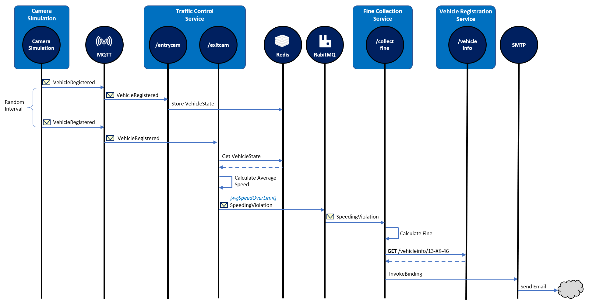
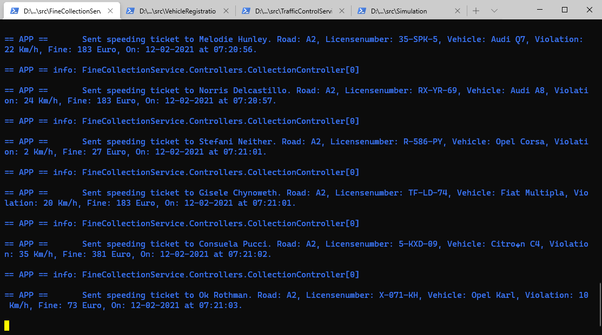
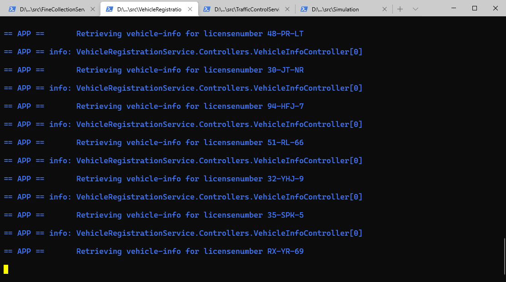
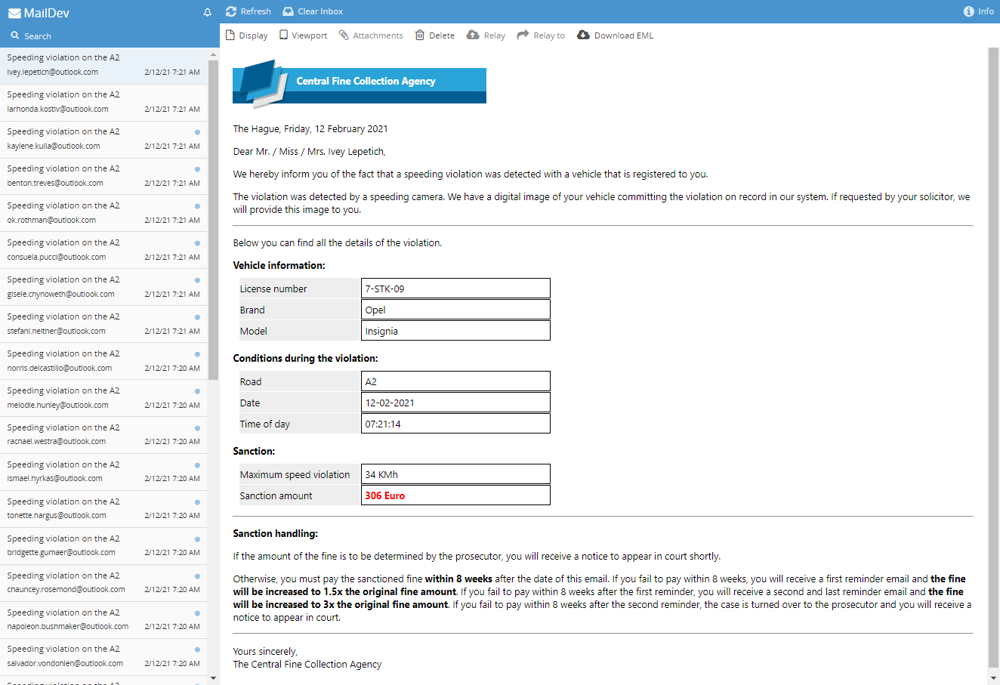

# Dapr Traffic Control Sample

| Attribute            | Details             |
| -------------------- | ------------------- |
| Dapr runtime version | v1.0.0              |
| .NET SDK version     | v1.0.0              |
| Dapr CLI version     | v1.0.0              |
| Language             | C# (.NET Core)      |
| Environment          | Local or Kubernetes |

This repository contains a sample application that simulates a traffic-control system using Dapr. For this sample I've used a speeding-camera setup as can be found on several Dutch highways. Over the entire stretch the average speed of a vehicle is measured and if it is above the speeding limit on this highway, the driver of the vehicle receives a speeding ticket.

## Overview
This is an overview of the fictitious setup I'm simulating in this sample:


There's 1 entry-camera and 1 exit-camera per lane. When a car passes an entry-camera, the license-number of the car is registered.

In the background, information about the vehicle  is retrieved from the Department Of Motor-vehicles - DMV (or RDW in Dutch) by calling their web-service.

When the car passes an exit-camera, this is registered by the system. The system then calculates the average speed of the car based on the entry- and exit-timestamp. If a speeding violation is detected, a message is sent to the Central Judicial Collection Agency - CJCA (or CJIB in Dutch). They will send a speeding-ticket to the driver of the vehicle.

## Simulation
In order to simulate this in code, I created several services as shown below:


- The **Camera Simulation** is a .NET Core console application that will simulate passing cars.
- The **Traffic Control Service** (or **TCS**) is an ASP.NET Core WebAPI application that offers 2 endpoints: *Entrycam* and *ExitCam*.
- The **Fine Collection Service** (or **FCS**) is an ASP.NET Core WebAPI application that offers 1 endpoint: *CollectFine* for for collecting fines.
- The **Vehicle Registration Service** (or **VRS**) is an ASP.NET Core WebAPI application that offers 2 endpoints: *GetOwnerInfo* for for getting the contact information of the driver of a speeding vehicle. 

The way the simulation works is depicted in the sequence diagram below:


1. The **Camera Simulation** generates a random license-number and sends a *VehicleRegistered* message (containing this license-number, a random entry-lane (1-3) and the timestamp) to the *EntryCam* endpoint of the **TCS**.
2. The **TCS** stores the VehicleState (vehicle information and entry-timestamp).
4. After some random interval, the **Camera Simulation** sends a *VehicleRegistered* message to the *ExitCam* endpoint of the **TCS** (containing the license-number generated in step 1, a random exit-lane (1-3) and the exit timestamp).
5. The **TCS** retrieves the VehicleState that was stored at vehicle entry.
6. The **TCS** calculates the average speed of the vehicle using the entry- and exit-timestamp.
7. If the average speed is above the speed-limit, the **TCS** calls the *CollectFine* endpoint of the **FCS**. The request payload will be a *SpeedingViolation* containing the license-number of the vehicle, the identifier of the road, the speeding-violation in KMh and the timestamp of the violation.
7. The **FCS** calculates the fine for the speeding-violation.
8. The **FCS** calls the *GetOwnerInfo* endpoint of the **VRS** to get the contact information of the driver of the speeding vehicle.
9. The **FCS** sends a fine to the owner of the vehicle by email.

All actions described in this sequence are logged to the console during execution so you can follow the flow.

## Dapr
This sample uses Dapr for implementing several aspects of the application. In the diagram below you see a schematic overview of the setup:


1. For doing request/response type communication with a service, the  **service invocation** building-block is used. 
1. For communicating messages, the **publish and subscribe** building-block is used. RabbitMQ is used as message broker.
1. For storing the state of a vehicle, the **state management** building-block is used. Redis is used as state store.
1.  Fines are sent to the owner of a speeding vehicle by email. For sending the email, the Dapr SMTP **output binding** is used.
1. A Dapr **input binding** for MQTT is used to send simulated car info to the TCS. Mosquitto is used as MQTT broker.
1. The FCS needs credentials for connecting to the smtp server. It uses the **secrets management** building block with the local file component to get the credentials.

Here is the sequence diagram again, but now with all the Dapr building-blocks and components:



## Running the sample in Dapr self-hosted mode
Execute the following steps to run the sample application in self hosted mode:

Start infrastructure components:

1. Make sure you have installed Dapr on your machine in self-hosted mode as described in the [Dapr documentation](https://docs.dapr.io/getting-started/install-dapr/).
2. Open a new command-shell.
3. Go to the folder `src/infrastructure` folder. 
4. Start the infrastructure services by executing `start-all.ps1` script. This script will start Mosquitto (MQTT broker), RabbitMQ (pub/sub broker) and Maildev. Maildev is a development SMTP server that does not actually sends out emails (by default). But it offers a web frontend for inspecting the emails that were sent to it.

Start the services:

1. Open new command-shell.

2. Change the current folder to the `src/VehicleRegistrationService` folder of this repo. 

3. Execute the following command (using the Dapr cli) to run the **VRS**:

    ```console
    dapr run --app-id vehicleregistrationservice --app-port 5002 --dapr-http-port 3502 --dapr-grpc-port 50002 --config ../dapr/config/config.yaml --components-path ../dapr/components dotnet run
    ```

    >  Alternatively you can also run the `start-selfhosted.ps1` script.

4. Open new command-shell.

5. Change the current folder to the `src/FineCollectionService` folder of this repo. 

6. Execute the following command (using the Dapr cli) to run the **FCS**:

    ```console
    dapr run --app-id finecollectionservice --app-port 5001 --dapr-http-port 3501 --dapr-grpc-port 50001 --config ../dapr/config/config.yaml --components-path ../dapr/components dotnet run
    ```

    > Alternatively you can also run the `start-selfhosted.ps1` script.

7. Open new command-shell.

8. Change the current folder to the `src/TrafficControlService` folder of this repo. 

9. Execute the following command (using the Dapr cli) to run the **TCS**:

    ```console
    dapr run --app-id trafficcontrolservice --app-port 5000 --dapr-http-port 3500 --dapr-grpc-port 50000 --config ../dapr/config/config.yaml --components-path ../dapr/components dotnet run
    ```

    > Alternatively you can also run the `start-selfhosted.ps1` script.

10. Open new command-shell.

11. Change the current folder to the `src/Simulation` folder of this repo. 

12. Execute the following command to run the **Simulation**:

     ```console
     dotnet run
     ```

You should now see logging in each of the shells, similar to the logging shown below:

**Simulation:**  


**TrafficControlService:**  


**FineCollectionService:**  



**VehicleRegistrationService:**  



To see the email that are sent by the FCS, open a browser and browse to [http://localhost:4000](http://localhost:4000). You should see the emails coming in:



## Running the sample on Kubernetes
Execute the following steps to run the sample application on Kubernetes:

First you need to build the Docker images for the three services:

1. Open a command-shell.

2. Change the current folder to the *src/k8s* folder of this repo.

3. Run the `build-docker-images.ps1` script to build all the Docker images.


Now you're ready to run the application on Kubernetes. 

1. Make sure you have installed Dapr on your machine on a Kubernetes cluster as described in the [Dapr documentation](https://docs.dapr.io/getting-started/install-dapr/).

2. Make sure you have built the Docker images for the services so they are available on your machine.

3. Open a command-shell.

4. Change the current folder to the *src/k8s* folder of this repo.

5. Execute the `start.ps1` script. All services will be created in the `dapr-trafficcontrol` namespace.


You can examine the logging for the services in several different ways. Let's do it using the Docker CLI:

1. Find out the container Id of the services:

    ```
    docker ps
    ```

  > Make sure you pick the Id of a container running the .NET service and not the Dapr sidecar (the command will start with `/daprd`). If you do pick the Id of a Dapr sidecar container, you can check out the Dapr logging emitted by the sidecar.

2. View the log for each of the services (replace the Id with the Id of one of your services):

    ```
    docker logs e2ed262f836e
    ```

To see the emails that are sent by the FCS, open a browser and browse to [http://localhost:30000](http://localhost:30000).

To stop the application and remove everything from the Kubernetes cluster, execute the `stop.ps1` script.

## Disclaimer
The code in this repo is NOT production grade and lacks any automated testing. It is intentionally kept as simple as possible (KISS). Its primary purpose is demonstrating several Dapr concepts and not being a full fledged application that can be put into production as is.

The author can in no way be held liable for damage caused directly or indirectly by using this code.
